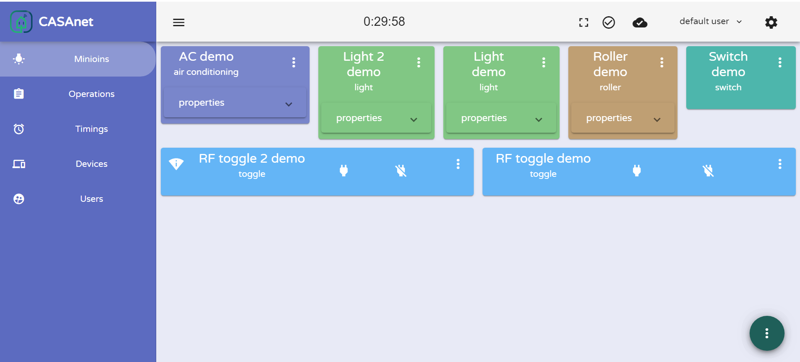
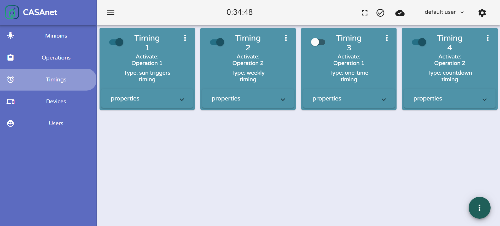

Let's create a smart home, without giving anyone access to our house 😊.

## CASA-NET.
Open-source server to control IoT devices in a local home network.

## Philosophy.
In this project, I wanted to solve a number of troubles. first of all, anyone who uses a number of smart devices (smart IR, smart socket, or anything of that kind) of different companies is familiar with the problem of dealing with a number of different applications;
holding 10 applications for each home appliance when each is completely different in the interface and operations and authentication.
It's a very annoying thing and in addition, the servers, some of which are small Chinese companies, do not always work well, so there is no external access, and there is no normal and clear message that tells you why it does not work.

And the biggest problem is security issues. I don't want to trust any company code/server in my home. I want to use open-source only, where I can make sure that no one tracks me or any other malicious code is running in my home. Also, I want to block all of my Chinese devices from communicating any server outside my local network.   

As a solution to these problems, this project consolidates all the smart home appliances into one simple, clear and easy to access API.
And on top of that, it runs on a computer (or any other device that can run Node.JS) at home and does not have to connect to the internet to work properly.

The logic and design of the server is that there are several types of devices in the world, such as a lighting device, an AC device, etc, and each physical device has its own module that realizes the capabilities that the device of its kind enables, (and the advanced options that each company realizes in a different way like timing, thrown), and on all devices there is a switch component with on\off option.

This structure enables the creation of a separate server and a collection of modules that enable communication by implementing preset methods for each device type (such as the OOP interface).

## How does it look?

Minimal page (only 5 kb of resources should be transferred !!!) for old phones or very slow networks.

Link to the minimal page exist in the settings 'light version' section, or just navigate to `[server-ip/host]/light-app/index.html`.

## Project parts + technologies
* **[Casanet server](./backend):**
	* **Purpose:** control the IoT devices in a local home network.
	* **Technologies:** [Node.js](https://nodejs.org/en/) (using TypeScript + [TSOA](https://github.com/lukeautry/tsoa)).
* **[Dashboard](./frontend):**
	* **Purpose:** The dashboard app (frontend) to control the IoT devices (using casanet server API). 
	* **Technologies:** [Angular](https://angular.io/) (using [angular material](https://material.angular.io/)).
* **[Remote server](https://github.com/casanet/remote-server):**
	* **Purpose:** Forward API requests from the wide internet to the local casanet servers.
	* **Technologies:** [Node.js](https://nodejs.org/en/) (using TypeScript + [TSOA](https://github.com/lukeautry/tsoa) + [PostgreSQL](https://www.postgresql.org/)).
* **[Remote dashboard](https://github.com/casanet/remote-dashboard):**
	* **Purpose:** Management dashboard for the remote server admin (using remote server API)
	* **Technologies:** [Vue.js](https://vuejs.org/) (using [vue material](https://vuematerial.io/)).
* **[RF commands repository](https://github.com/casanet/rf-commands-repo):**
	* **Purpose:** Light-weight server to keep and serve RF commands (such as: IR, 433 MHz etc.) for appliances.
	* **Technologies:** Python 3.7.3 (using [Flask](https://palletsprojects.com/p/flask/) + [Mongodb](https://www.mongodb.com/)).
* **API (for local and remote server):**
	* **Technologies:** [Swagger](https://swagger.io/).

### Dashboard Languages support
The UI is designed to support multi-Language.

Current supported Languages:
* English
* Hebrew

Any support for other languages will be welcome.

## How to use it?
* Run casa-net server in a home network [see documentation](./backend/README.md).
* Run casa-net remote server in cloud service [see documentation](https://github.com/casanet/remote-server).

## Accessing casanet server from the internet
The server needs to run on local home network. So how does one access it via the local home network? How does one get access to the casanet local server from the internet?

#### Method 1: Port forwarding
Make sure that the IP address of your home is public and redirect ports in-home router to the computer that is running the casanet server.

(DDNS is recommended for easy access to the home IP address).

#### Method 2: Using casa remote server
The casa remote server is built for this, [casanet-remote](https://github.com/casanet/remote-server) run on cloud service and used to redirect API requests to the local server.

## Supported IoT devices / protocols

-  Orvibo (aka wiwo)

	-  S20 (socket). [link](https://www.aliexpress.com/item/2016-New-Orvibo-Home-Automation-EU-U-UK-AU-Standard-Smart-Power-Travel-Socket-Plug-4G/32793333967.html)

-  Broadlink

	-  SP3 (socket). [link](https://www.gearbest.com/smart-access-lock/pp_009282693865.html)
	-  RM mini 3 (As AC). [link](https://www.gearbest.com/alarm-systems/pp_009753807797.html)
	-  RM Pro (As AC / RF toggle / RF curtain). [link](https://www.gearbest.com/home-appliances-accessories/pp_009281768756.html)

-  Yeelight

	-  Light with temperature and brightness properties. [link](https://www.gearbest.com/round-ceiling-lights/pp_009555929473.html) and others.
	-  Light with RGBW properties. [link](https://www.gearbest.com/smart-bulbs/pp_009329720794.html) and others.
    
-  Tuya (aka smart life)

	-  Switch (3 or less gangs). [link](https://www.aliexpress.com/item/220V-EU-Standard-3-Gang-Control-LED-Indicate-TUYA-Smart-App-Light-Touch-Switch-work-with/32952608844.html) [link](https://www.aliexpress.com/item/WiFi-Smart-Boiler-Switch-Water-Heater-Smart-Life-Tuya-APP-Remote-Control-Amazon-Alexa-Echo-Google/32981607525.html) and others.
	-  Curtain switch. [link](https://www.aliexpress.com/item/Tuya-Smart-Life-WiFi-Curtain-Switch-for-Electric-Motorized-Curtain-Blind-Roller-Shutter-Google-Home-Amazon/33006009742.html) and others.

- Mi (aka xiaomi)
    
    -  Philips LED Ceiling Lamp. [link](https://www.gearbest.com/smart-ceiling-lights/pp_009933492211.html)
	-  Robot Vacuum. [link](https://www.gearbest.com/robot-vacuum/pp_440546.html)

- Tasmota
    
    - Switch (tested with [this](https://www.gearbest.com/robot-vacuum-accessories/pp_009661965579.html?wid=1433363) and [this](https://www.gearbest.com/alarm-systems/pp_009227681096.html?wid=1433363)) 

- [IFTTT](https://ifttt.com/discover) module. [module use documentation](./backend/src/modules/ifttt/README.md)..

    - Toggle.
    - Switch.
    
- [MQTT](http://mqtt.org/) module. [module use documentation](./backend/src/modules/mqtt/README.md).
    -  Toggle.
    -  Switch.
    -  Air-conditioning.
    -  Light
    -  Temperature light.
    -  Color light.
    -  Roller.
    
- Mock (for testing only)
    
    -  Toggle demo.
    -  Switch demo
    -  Air-conditioning demo.
    -  Light demo.
    -  Temperature light demo.
    -  Color light demo.
    -  Roller demo.
    
## Supported soon.

## Adding other devices support
Yes, it is possible and is welcomed, see [modules](./backend/src/modules/README.md#-for-development-only-).

## Using scenario
To see a simple using scenario go to [using scenario](./docs/using-scenario.md) doc.

To explorer the full API specs use [swagger UI](https://petstore.swagger.io/) and put `https://raw.githubusercontent.com/casanet/casanet-server/master/backend/swagger.yaml` in explorer input.

## IFTTT integration
The [IFTTT](https://ifttt.com/discover) ecosystem is great ;). 
Now, invoking triggers when a minion turned on/off or turning on/off minion when any IFTTT trigger invoked is possible.

The integration is using [WebHooks](https://ifttt.com/maker_webhooks) API.

Receiving invoked triggers allow only if the casa-net server accessible via public internet or via a remote server.

Invoking triggers when a device turned on/off the local server requires an internet connection.  

See [step by step instruction ](./docs/IFTTT.md) to use IFTTT.

## TODO

- [X] Finish UI of casanet local server.
- [X] Faster boot time for the angular dashboard app.  

Feel free to open an issue with a bug report or feature to develop for the next version.

For any suggestions or help feel free to contact me.

## Casanet server deployment
Although there is no way to run the server in a docker container because the app should scan the real local network.
I made a [Linux deployment tutorial](./docs/LINUX.md) for a Linux based devices (raspberry pi etc.)

### The casanet server tested on
* Windows 7
* Windows 10
* Linux Ubuntu
* Orange PI Armbian (Debian-based)
* Raspberry PI Raspbian

## Credits
* Logo and UX consulting [Ofek Avergil](https://il.linkedin.com/in/ofek-avergil-348260144).

Shared with :heart: by kastnet.

---
> Version 1 of the project placed in [here](https://github.com/casanet/casanet-server/tree/archive-v1), maintaining for security and fatal bugs fixes only.
---
